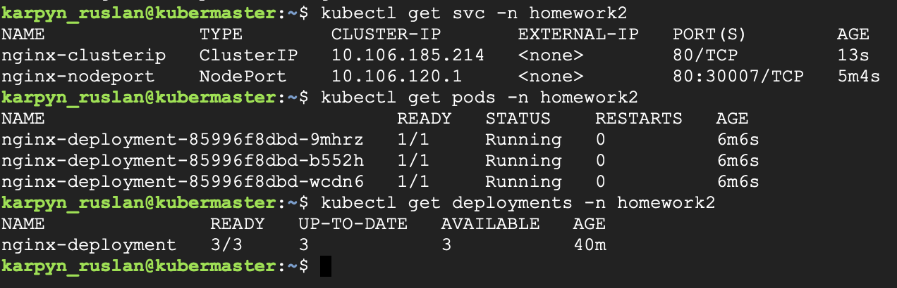
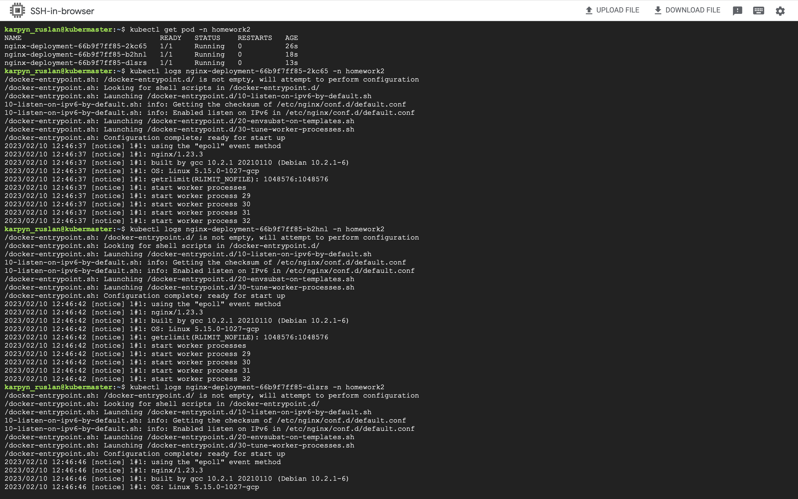

## Task2.-K8S

Using K8S cluster that was created at the previous [Home Task](https://github.com/Heckfy05/Task1.-K8S) running on GCP.
1. Get information about your worker node and save it in some file
   `kubectl describe nodes kubenode > NodeInfo.txt`

[File](https://github.com/Heckfy05/Task2.-K8S/blob/main/NodeInfo.txt) with the information about node.

2. Creating a new namespace (homework2) all resources will be created in homework2 namespace

3. Preparing [deployment.yaml](https://github.com/Heckfy05/Task2.-K8S/blob/main/deployment.ymal) file that will create a Deployment with 3 pods of Nginx and service for access to these pods via ClusterIP and NodePort.
As resoults of deploying:

Status of the deployment, pods and services:

[Description](DescribePods.txt) of the Pod's
`kubectl describe pods -n homework2 > DescribePods.txt`

[Description](DescribeServices.txt) of the Services
`kubectl describe service -n homework2 > DescribeServices.txt`

Logs from Pods:

4. Preparing two job yaml files for:
   4.1 Getting content via curl from an internal port (ClusterIP) - [JobCurlClusterIp.yaml](JobCurlClusterIp.yaml)
   Applaying Job by:
   `kubectl apply -f JobCurlClusterIp.yaml`
   Getting logs by comannd:
   `kubectl logs job.batch/curlclusterip -n homework2`

   4.2 Getting content via curl from an external port (NodePort) - [JobCurlNodePort.yaml](JobCurlNodePort.yaml)
   Applying Job by:
   `kubectl apply -f JobCurlNodePort.yaml`
   Geting logs by:
   `kubectl logs job.batch/nodeport -n homework2`
   
5. Creating [Cronjob.yaml](Cronjob.yaml) file which tests the connection to Nginx service every 3 minutes.
   Applying the CronJob.yaml by:
   `kubectl apply -f Cronjob.yaml`
   As the resoult:
   